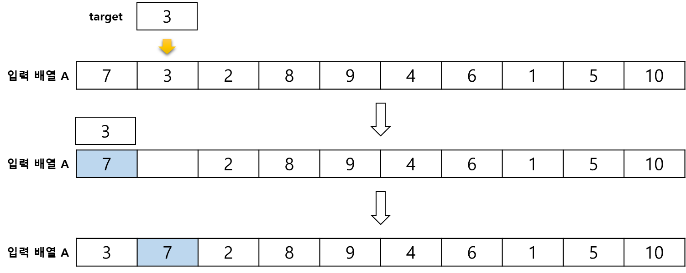
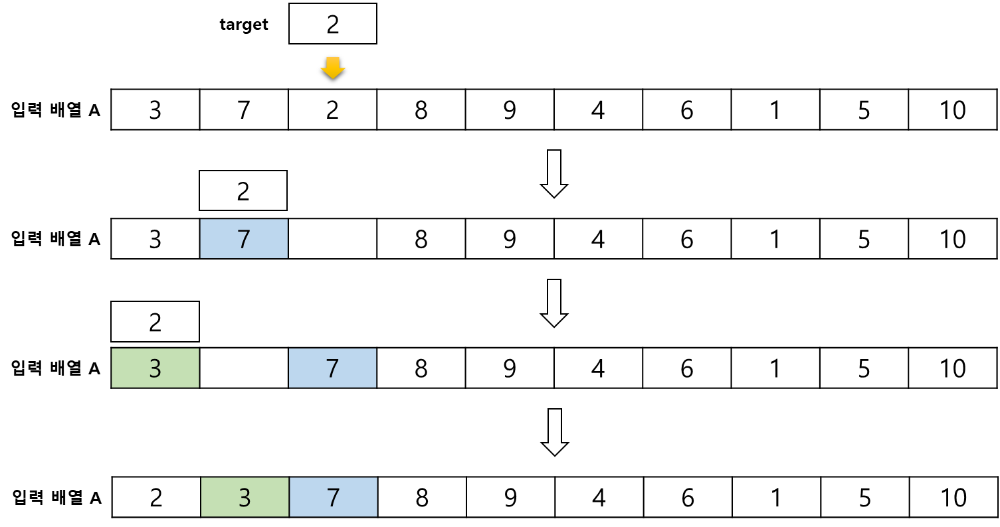

# [자료 구조] 정렬 - Insertion Sort (삽입 정렬)

**Insertion Sort** 란, 타겟을 정해, 이전 원소들과 비교하여 자리를 교환하면서 정렬을 수행하는 정렬 알고리즘이다.   
타겟을 이전 원소들과 비교하면서 정렬을 수행하기 때문에, 추가적인 공간 할당이 필요없어 **제자리 정렬 알고리즘** 이다.

## 정렬 과정
현재 타겟과 이전 원소를 비교하여 타겟보다 이전 원소가 작다면 이 둘의 자리를 교환한다.

 

타겟을 다음으로 하여, 위 과정을 반복한다.

.  
.  
.  

## 시간 복잡도
알고리즘 과정을 보면 타겟이 되는 숫자가 이전 요소의 숫자보다 클 때까지 반복한다.   
이미 정렬이 되어있는 경우라면 항상 타겟이 되는 숫자가 이전 요소의 숫자보다 크기 때문에 정렬을 위한 반복이 필요없다.
정렬을 위해 값을 N 번만 비교하므로, 최선의 경우 시간 복잡도는 **O(n)** 이다.

내림차순으로 정렬된 배열을 오름차순으로 정렬한다고 가정해보자.
이 상황은 타겟이 맨 앞으로 갈 때까지 데이터 비교가 항상 발생하므로, 최악의 경우이다.

i=2 일 때, 데이터 비교 2 - 1 번   
i=3 일 때, 데이터 비교 3 - 1 번   
i=4 일 때, 데이터 비교 4 - 1 번   
i=n 일 때, 데이터 비교 n - 1 번   

이를 공식화 하면, 시간 복잡도는 **O(n²)** 이 된다.

그렇다면 평균적인 시간 복잡도는 이 둘을 더하여 2로 나누면 된다.
( O(n) + O(n²) ) / 2 는 상한선이라는 개념에 의해 O(n²) 이 된다.

정리
- 최상: **O(n)**
- 평균: **O(n²)**
- 최악: **O(n²)**

삽입 정렬은 버블 정렬이나 선택 정렬과 시간 복잡도는 동일하지만 평균 비교 횟수에 대한 기대값이 상대적으로 적어 시간 복잡도가 **O(n²)** 빠른 알고리즘에 속한다.

삽입 정렬은 두 값을 비교하여 작을 때만 교환을 수행하기 때문에,   
같은 값이 있을 때, 교환이 수행되지 않아 순서를 보장할 수 있다.   
그러므로, 삽입 정렬은 **안정 정렬**이다.