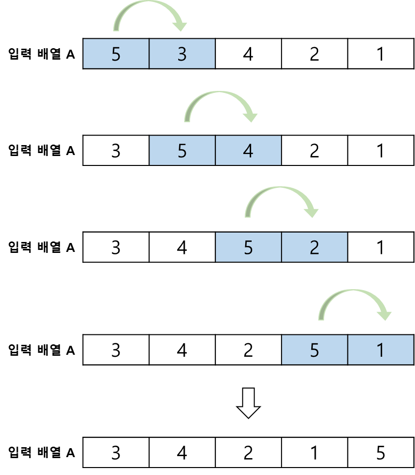
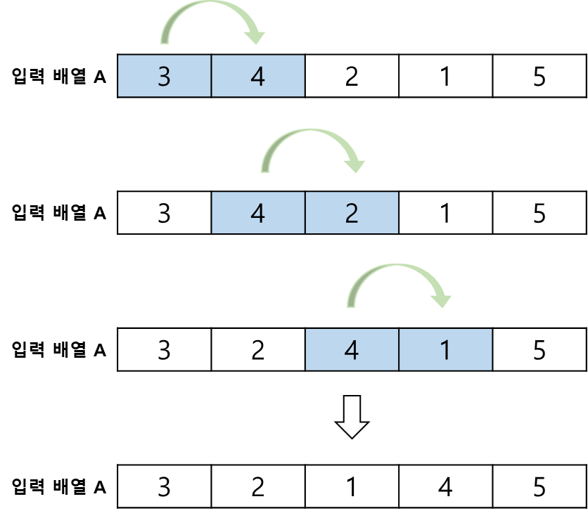
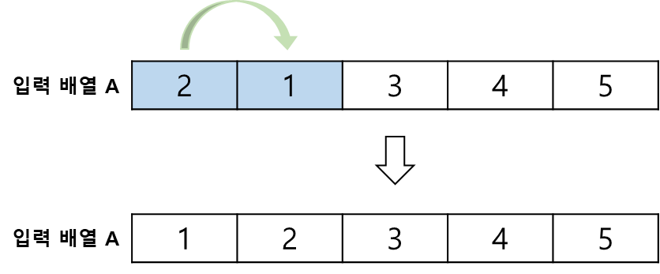

# [자료 구조] 정렬 - Bubble Sort (버블 정렬)

**Bubble Sort** 란, 인접한 원소를 비교하여 정렬을 수행하는 정렬 알고리즘이다.   
정렬의 대상 외 추가적인 공간이 필요하지 않아, **제자리 정렬 알고리즘** 이다.

 

## 정렬 과정
첫 번째 원소부터 다음 원소와 비교하여 다음 원소보다 크다면 서로 원소를 교환한다. 

 

버블 정렬은 한 라운드에 하나의 원소가 정렬되기 때문에, 다음 라운드 진행 시 비교 횟수를 하나씩 줄여가면서 반복한다.

.  
.  
.  

## 시간 복잡도
알고리즘 과정을 보면 각 라운드의 반복 횟수는 **총 배열 - 라운드 수** 이다.   
최악의 경우 또는 최상의 경우, 비교하는 횟수는 동일하기에 시간 복잡도는 **O(n²)** 이다.

i=1 일 때, 데이터 비교 n - 1번   
i=2 일 때, 데이터 비교 n - 2 번   
i=3 일 때, 데이터 비교 n - 3 번   
i=4 일 때, 데이터 비교 n - 4 번   
i=n 일 때, 데이터 비교 1 번

이를 공식화 하면 n(n-1) / 2, 시간 복잡도는 **O(n²)** 이 된다.

그러나 비교할 때 서로 원소를 교환하지 않는다면 이미 정렬되었다고 판단하여 정렬을 종료하는 조건을 추가해보자.   
최악의 경우에는 시간 복잡도는 **O(n²)** 으로 동일하겠지만, 최선의 경우 배열의 크기만큼만 비교하면 되기 때문에 시간 복잡도는 **O(n)** 이 된다.

따라서 일반적으로 스왑 조건의 유무에 따라 최선의 경우 시간복잡도를 **O(n²)** 또는 **O(n)** 이라고 한다.

버블 정렬은 같은 시간 복잡도를 보이는 삽입 정렬과 선택 정렬보다 평균적으로 비교 횟수가 많기 때문에 잘 사용되지 않는다.   

버블 정렬은 큰 값만 자리를 교환하기 때문에 같은 값의 정렬을 보존할 수 있다. 
그러므로, 삽입 정렬은 **안정 정렬**이다.